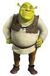

# Инструкция для работы с Markdown

## Выделение текста

Чтобы выделить текст курсивом, необходимо обрамить его (*) или знаком нижнего подчеркивания (_) или *вот так*, _вот так_

Чтобы выделить текст полужирным необходимо обрамить его (**) или знаком нижнего подчеркивания (__), **вот так** или __вот так__

Альтернативный способ выделения жирным или курсивом нужны для того, чтобы мы могли совмещать оба этих способа. Например, _текст может быть выделен курсивом и при этом быть **полужирным**_

## Списки

чтобы выделить ненумерованный список используйте (*)

## Работа с изображениями

Чтобы вставить изображение в текст, достаточно написать следующее 

## Ссылки

## Работа с таблицами

## Цитаты

## Заключение